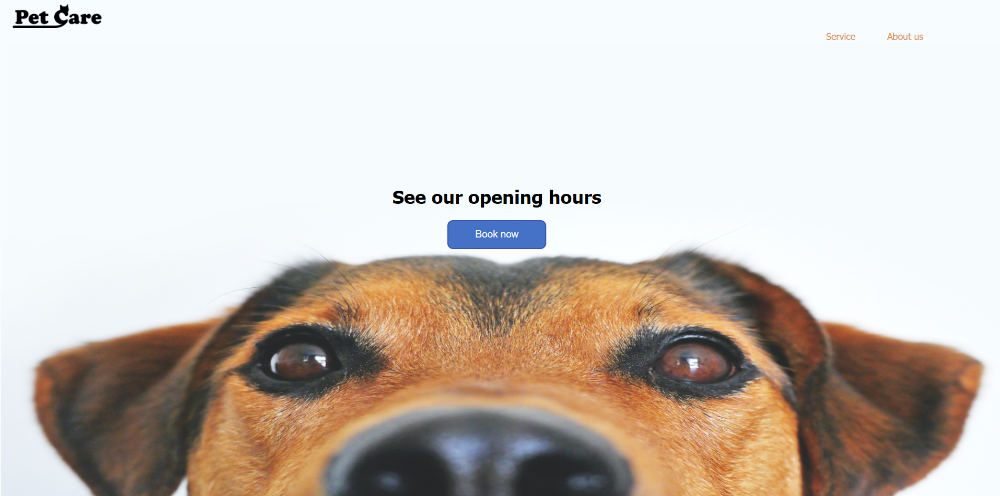
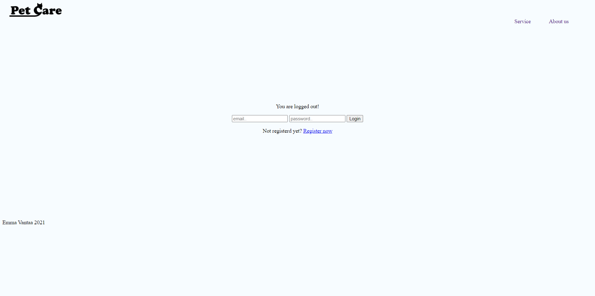
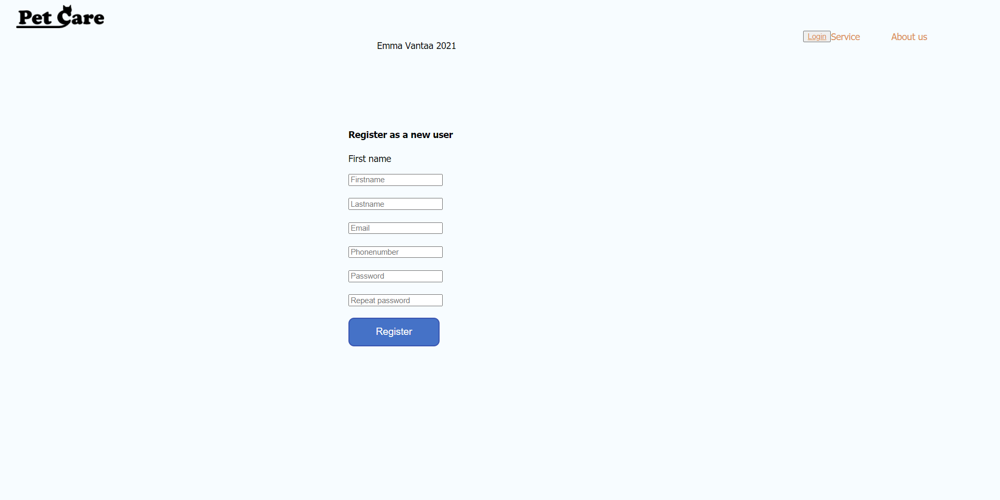
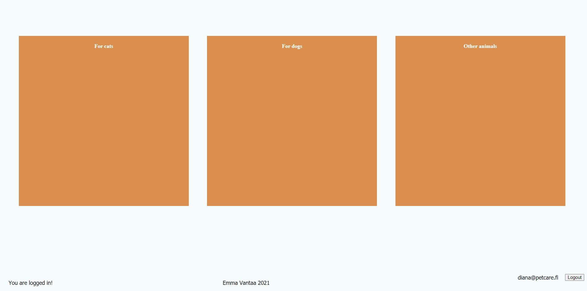

# Php Petcare
Personal project made for learning PHP.  
While working at PHZ Full Stack I noticed they used php on some projects, I decided to look more into it and noticed it was still used in for example Wordpress.
I also wanted to have some kind of project with backend, so Php sounded quite fitting for this.    

Previously I had mainly worked with Html/Css and with a pinch of asp.net mvc in C#.  

Local backend was created using myphpadmin  

Screenshots of the webpage  
  
 
 
 
